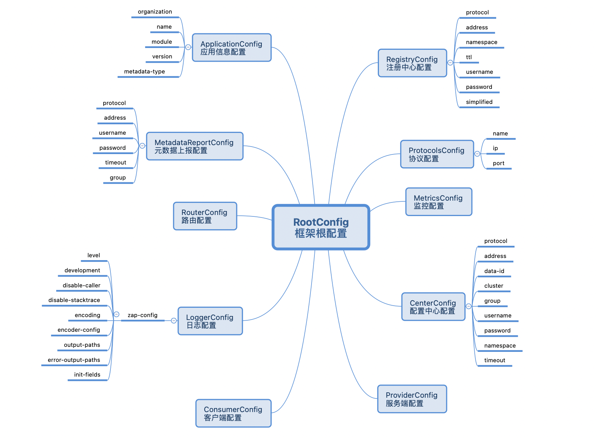

# Dubbogo 配置项

## 1. 配置结构

### 1.1 框架配置结构

- 根配置



- ProviderConfig


- ConsumerConfig


### 1.2 全部配置例子

```yaml
dubbo:
  application:
    name: dubbo-go
    module: local
    version: 1.0.0
    owner: zhaoyunxing
  protocols:
    tripleProtocol:
      name: tri
      port: 20001
    dubboProtocol:
      name: dubbo
      port: 20000
      params:
        reconnect-interval: 0
        connection-number: 1
        heartbeat-period: 5s
        session-timeout: 180s
        pool-size: 64
        pool-ttl: 600
        getty-session-param:
          compress-encoding: false
          tcp-no-delay: true
          tcp-keep-alive: true
          keep-alive-period: 120s
          tcp-r-buf-size: 262144
          tcp-w-buf-size: 65536
          pkg-rq-size: 1024
          pkg-wq-size: 512
          tcp-read-timeout: 1s
          tcp-write-timeout: 5s
          wait-timeout: 1s
          max-msg-len: 1024000
          session-name: client
  center-config:
    protocol: nacos
    address: 127.0.0.1:8848
    group: dubbo
    namespace: dubbo
    timeout: 10s
    params:
      username: nacos
      password: 123456
  registries:
    zk:
      protocol: zookeeper
      timeout: 3s
      address: 127.0.0.1:2181
    nacos:
      timeout: 5s
      address: nacos://127.0.0.1:8848
  consumer:
    registryIDs: zk
    references:
      GreeterImpl:
        protocol: dubboProtocol
        serialization: hessian2
        interface: com.apache.dubbo.sample.basic.IGreeter
  provider:
    register: true
    registryIDs: zk
    services:
      DubboGreeterImpl:
        protocolIDs: dubboProtocol
        serialization: hessian2
        interface: com.apache.dubbo.sample.basic.IGreeter
      TripleGreeterImpl:
        protocolIDs: tripleProtocol
        serialization: protobuf
        interface: com.apache.dubbo.sample.basic.TripleService
 
```

## 2. 框架读取配置方式

### 2.1 从文件读取

1. 需要按照上述配置结构，定义 dubbogo.yml 文件，并在应用启动之前设置环境变量 `DUBBO_GO_CONFIG_PATH`为 dubbogo.yml 的位置。
2. 在代码中，调用 config.Load 方法，启动框架。一个例子如下：

```go
// export DUBBO_GO_CONFIG_PATH= PATH_TO_SAMPLES/helloworld/go-client/conf/dubbogo.yml
func main() {
    // set consumer struct if needed
    config.SetConsumerService(grpcGreeterImpl)
    
    // config loader start
    if err := config.Load(); err != nil {
        panic(err)
    }
    
    // waiting for service discovery finished
    time.Sleep(3 * time.Second)
    
    logger.Info("start to test dubbo")
    req := &api.HelloRequest{
        Name: "laurence",
    }
    // do RPC invocation
    reply, err := grpcGreeterImpl.SayHello(context.Background(), req)
    if err != nil {
        logger.Error(err)
    }
    logger.Infof("client response result: %v\n", reply)
}
```

### 2.2 配置 API

用户无需使用配置文件，可直接在代码中以 API 的调用的形式写入配置，如前面"快速开始"部分所提供的例子: 

```go
func main() {
    // init rootConfig with config api
    rc := config.NewRootConfigBuilder().
        SetConsumer(config.NewConsumerConfigBuilder().
            SetRegistryIDs("zookeeper").
            AddReference("GreeterClientImpl", config.NewReferenceConfigBuilder().
                SetInterface("org.apache.dubbo.UserProvider").
                SetProtocol("tri").
                Build()).
            Build()).
        AddRegistry("zookeeper", config.NewRegistryConfigWithProtocolDefaultPort("zookeeper")).
        Build()
    
    // validate consumer greeterProvider
    if err := rc.Init(); err != nil{
        panic(err)
    }
    
    // waiting for service discovery
    time.Sleep(time.Second*3)
    
    // run rpc invocation
    testSayHello()
}
```

配置 API 看上去写法较为复杂，但单个配置结构的构造过程都是一致的，参考 Java  Builder 的设计，我们在配置 API 模块选用 `New().SetA().SetB().Build()`的方式来构造单个配置结构。

将上述例子中的 rootConfig 构造过程，可以拆解为：

```go
referenceConfig := config.NewReferenceConfigBuilder().
    SetInterface("org.apache.dubbo.UserProvider").
    SetProtocol("tri").
    Build()

consumerConfig := config.NewConsumerConfigBuilder().
    SetRegistryIDs("zookeeper").
    AddReference("GreeterClientImpl", referenceConfig).
    Build()).

registryConfig := config.NewRegistryConfigWithProtocolDefaultPort("zookeeper")

rc := config.NewRootConfigBuilder().
    SetConsumer(consumerConfig).
    AddRegistry("zookeeper", registryConfig).
    Build()
```

### 2.3 从配置中心读取

Dubbogo 服务框架支持将配置文件 'dubbogo.yml' 的内容预先放入配置中心，再通过配置注册中心的地址。在本地 dubbogo.yml 配置文件内只需写入配置中心的信息即可，目前支持作为配置中心的中间件有：apollo、nacos、zookeeper

可参考[配置中心Samples](https://github.com/apache/dubbo-go-samples/tree/master/configcenter)

```yaml
dubbo:
  config-center:
    protocol: apollo
    address: localhost:8080
    app-id: demo_server
    cluster: default
    namespace: demo-provider-config
```

下一章：[【Dubbogo Samples 介绍】](../samples/samples_repo.html)